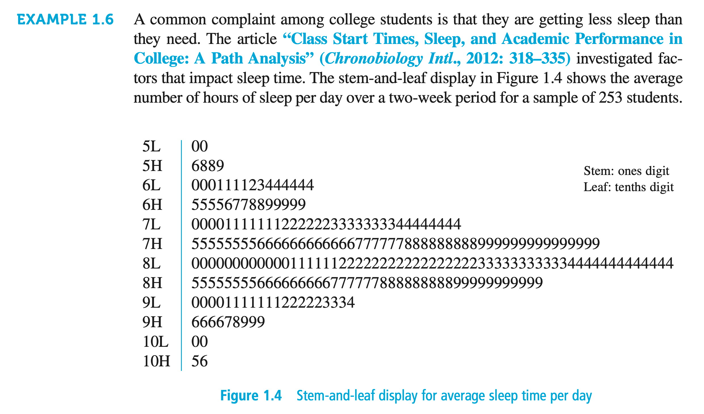
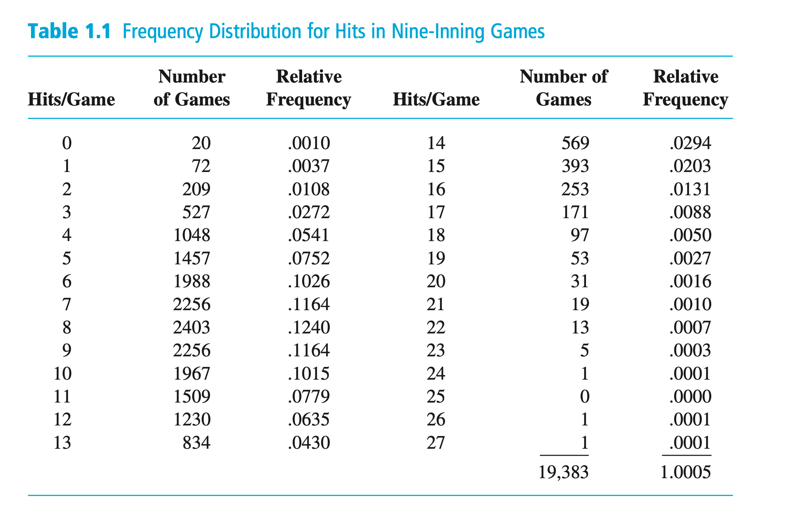
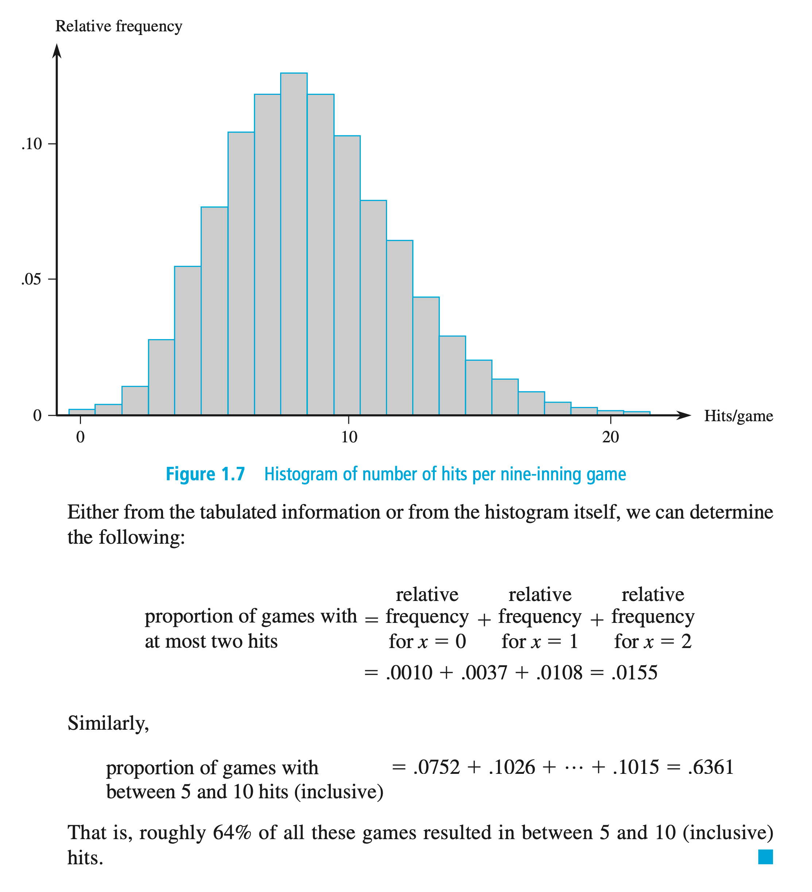
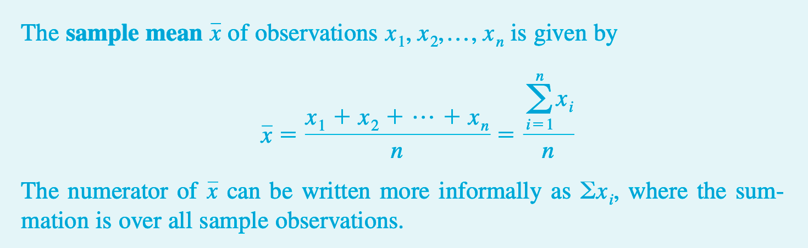

Notes for Devore's [[Probability_and_Statistics_for_Engineering_and_the_Sciences__Devore.pdf |Probability and Statistics for Engineering and the Sciences]]

-----

# Chapter 1

## §1.1 - Overview and Descriptive Statistics

##### *Pg.3*

**Data**: Collection of facts, observations, etc

**Population** well-defined collection of objects

**Census**: Info available for all objects in population

**Sample**: Subset of population to study

**Variable**: Any characteristic that may vary between objects in a population

**Univariate**: Data set of observations on a single variable
> e.g. Set of cars, variable is transmission type (manual or automatic), making a *categorical univariate data set*: {M,A,A,A,M,A,M,...}

> e.g. Set of patients, variable is heart BPM, the *numerical univariate data set*: {88, 80, 71, 103, ...}

##### *Pg.4*

**Bivariate, Multivariate**: As above, but with two or more variables

**Descriptive statistics**: Methods of describing & summarizing data
> *e.g.* Visual summary: scatter plot, histogram, box plot, etc

> *e.g.* Numerical summery: mean, std dev, correlation coefficient, etc

##### *Pg.6*

> *"The main focus of this book is on presenting and illustrating methods of inferential statistics that are useful in scientific work."*

**Ch 2-5**: Probability. Segues from descriptive to inferential techniques.

**Ch 6-8:** Important types of inferential procedures: point estimation, hypothesis testing, estimation by confidence intervals

**Ch 9-16:** More complex uses of inf methods

**Probability**: Properties of population are assumed known, questions about sample posed & answered

*"Probability reasons from the population to the sample (deductive reasoning)"*

**Statistics**: Characteristics of population are available, allows experimenter to draw conclusions about population.

"Inferential statistics reasons from sample to population (inductive reasoning)"*

"Before we can understand what a particular sample can tell us about the population, we should first understand the uncertainty associated with taking a sample from a given population. This is why we study probability before statistics."

*Ex 1.3*:

Probability: Ask "what percent drivers in X city wear seatbelt?", then sample 100 drivers

Inferential stats has sample info available already, e.g. a sample of 100 drivers in city X show that 65 use seatbelt; we then ask "Does this provide evidence that >50% of all drivers in this area wear seatbelts?"

Latter scenario, using sample info to answer question about the whole population from the given sample.

##### *Pg.7*

**Conceptual population / Hypothetical population**: Population consisting of all possible variables under given conditions.

##### *Pg.9*

W.E. Demming: influential American statistician introduced ***Enumerative Studies*** and ***Analytic Studies***

***Enumerative Studies***: Study focused on a finite, identifiable, unchanging collection of individuals forming a population

The ***Sampling frame*** *(list of individuals to be sampled)* is available to experimenter.

> e.g. all signatures on a petition. Sample is usually selected to determine if number of *valid* signatures exceeds a value

***Analytic Studies***: Study not enumerative in nature.

Often carried out to improve future thing by taking action on a process

> e.g. recalibrate machinery for efficiency

Data can only be obtained on an existing process that may significantly differ from the future process being formulated.

No sampling frame

> e.g. Five prototype turbines created to investigate efficiency. CAN be seen as conceptual population of all prototypes that can be manufactured under same/similar conditions, but NOT necessarily representative of those manufactured under other conditions (e.g. different production line creating non-prototype turbines)

Inferring on future from samples may have problems, likely needs a domain expert to judge if extrapolation is reasonable

> See also:
> 
> “Assumptions for Statistical Inference” by Gerald Hahn and William Meeker (The American Statistician, 1993: 1–11).

##### Pg.10

*Collecting Data*

Data collection important

Common problem is target population may be different than sample population

**Simple Random Sample**: easy way to try to get representative selection

**Stratified Sampling**: separate population into overlapping groups, pick sample from each group

**"Convenience" sample**: grab whichever samples are easy to get. this is usually bad

### §1.1 - Exercises
##### Pg.12
Questions 1-9
TODO

## §1.2 - Pictorial and Tabular Methods in Descriptive Statistics

*pg.13 - 14*

Descriptive stats divided into 2 subject areas:
- (1.2) Represent data set w visual displays
- (1.3-1.4) Numerical summary measures

### Notation
- **Sample Size**: *n, m* (sometimes with subscripts)
- Data set of *n* observations donated by  *x₁, x₂, x₃,..., xₙ*
	- *i*th observation denoted x subscript i

### Stem and Leaf Displays

Little frequency diagram with prefix and suffixes

> e.g. Test scores 0 - 100; score 83 has stem 8 and leaf 3

*Example 1.6, Fig 1.4 - Stem and Leaf diagram (screenshot)*


*Example 1.8, Fig 1.6 - Stem and Leaf diagram (screenshot)
![[../../Assets/stem-leaf-ex1.8.png]]


### Histograms
*pg.16*

Histograms differ if numeric data is obtained by counting to determine value of variable, or if data is obtained by taking measurements.


>***Vocab***
> 
**Discrete**: numeric variable whose set of possible values is finite or can be listed as in infinite sequence.
>
**Continuous**: numeric variable whose values consist of an interval on a number line.

A discrete variable *x* is almost always from counting, usually a subset of positive integers

Continuous variables are from measurements

> ***Vocab***
> 
> **Frequency**: number of times value *x* occurs in a data set
>
> **Relative Frequency:** fraction/proportion of times value occurs

#### Relative frequency formula

```
                           number of times value occurs
relative frequency  =   ----------------------------------
                        number of observations in data set
```

- theoretically, relative frequencies of all items in set should sum to 1, but can vary slightly with rounding.
- multiply relative frequency by 100 for a percent


#### Histogram for Discrete Data

- Determine freq and rel freq for each *x*
- X axis is frequency
- Y axis relative frequency

#### Histogram Examples
*Table 1.1, Fig 1.7 (Screenshot)*



#### Histograms for Continuous Data

##### Equal Class Widths
- Determine freq and rel freq for each class
- Class boundaries on X axis
- Intervals on Y axis
 
##### Unequal Class Widths
- Each bar height is:
```
             rel freq of class
bar height = -----------------
                class width
```
- Note: area of each bar is the relative freq of the corresponding class
- Sum of rel freqs = 1; total area of all bars = 1

#### Histogram Shapes

- **Unimodal** histogram rises to a single peak and declines
- **Bimodal** has two peaks
- **Multimodal** ya know

- **Symmetric**: same on both sides of histogram
- **Positive skew**: right / upper tail is stretched further than left / lower tail
	- lump on left, long slope down from lump to the right
- **Negative skew**: opposite
	- lump on right, long slope leading up to lump

## §1.3 - Measures of Location

### Mean

aka *arithmetic mean*, aka *average*, aka *sample mean* when it's for the sample



